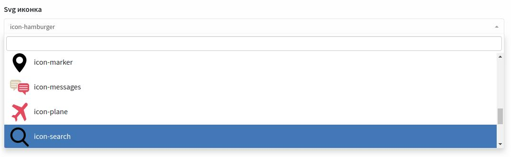

# laravel-backpack-select2-svg
Select2 for picking inline svg icons in backpack admin panel.
 
## Installation
> Publish view \
`php artisan vendor:publish --provider="Magnatiwe\Laravel\Backpack\SelectSvgField\SelectSvgFieldServiceProvider"`
>
## Usage
>         CRUD::addField([ 
>                  'name' => 'svg_icon',
>                  'label' => 'Svg icon',
>                  'type' => 'select2_svg',
>                  'svg_path' => 'assets/img/sprite.svg', // path to your svg file
>                  'allows_null' => true,
>              ]);